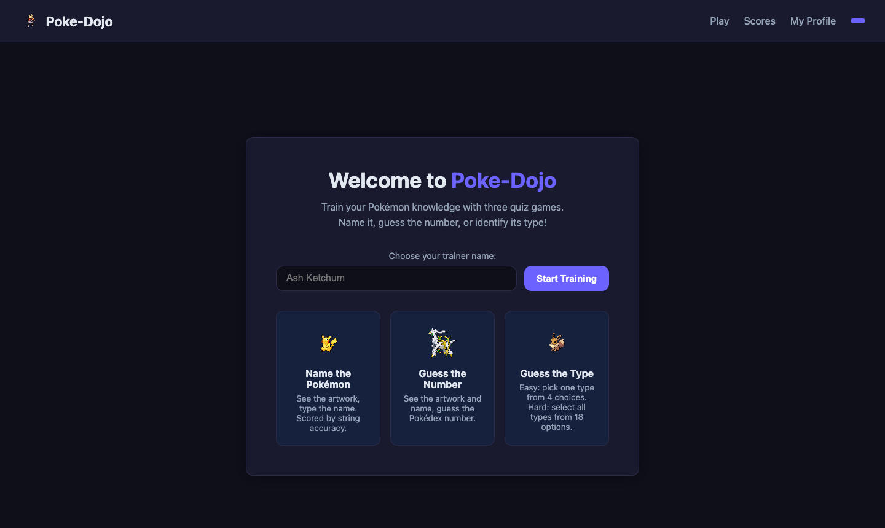
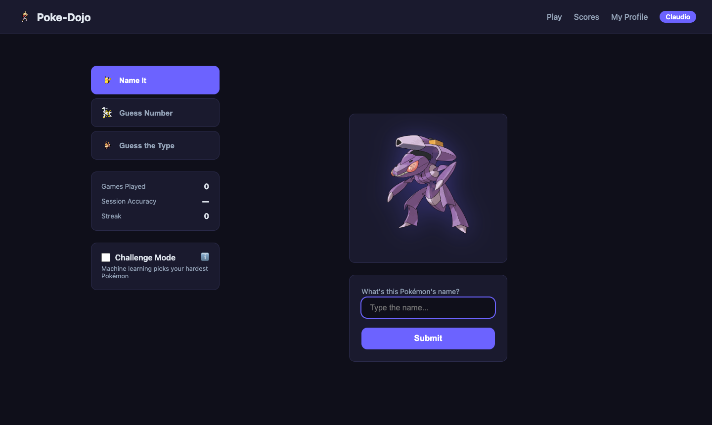
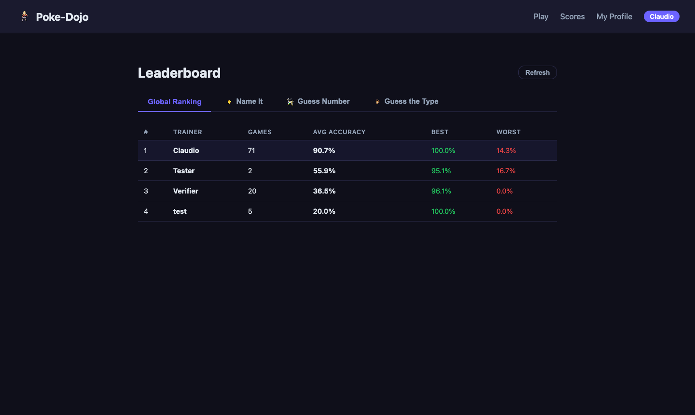
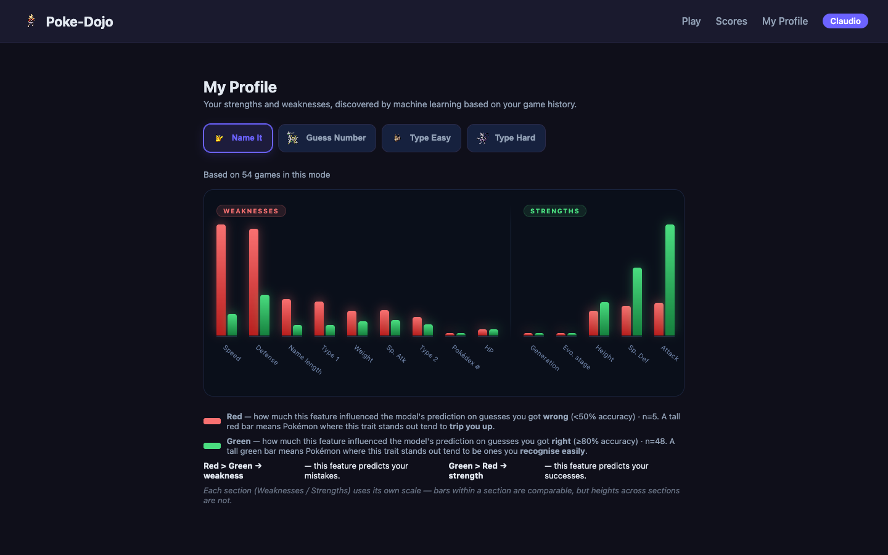

# Poke-Dojo 

A local Pokémon quiz app with three game modes, a leaderboard, and a machine-learning **Challenge Mode** that learns which Pokémon trip you up — then serves them more often. After 20 games, a personal **My Profile** page shows your strengths and weaknesses.

---

## Screenshots

### Welcome Screen
Enter your trainer name to start — no account needed. Your session is saved in the browser.



### Gameplay
Three modes in one place: **Name It**, **Guess Number**, and **Guess the Type**. Challenge Mode unlocks per-mode after 20 games and uses machine learning to pick your hardest Pokémon.



### Leaderboard
Global ranking and per-mode tabs. Best and worst scores shown per trainer.



### My Profile
After 20 games in a mode, machine learning analyses your history to reveal your strengths and weaknesses. The bar chart compares feature influence when you got guesses **right** (green) vs **wrong** (red) — sorted so your biggest weaknesses appear on the left.



---

## Installation

### Requirements
- Python 3.12+
- [uv](https://docs.astral.sh/uv/) (fast Python package manager)
- macOS: `brew install libomp` (required by XGBoost)

### Setup

```bash
# 1. Clone the repo
git clone https://github.com/calbornozflores/poke-dojo.git
cd poke-dojo

# 2. Install dependencies
uv sync

# 3. macOS only — XGBoost needs OpenMP
brew install libomp
```

---

## Running

```bash
uv run uvicorn app.main:app --reload
```

Open **http://localhost:8000**.

**First run:** the app automatically fetches all 1025 Pokémon from PokéAPI in the background (~3–4 min). Subsequent starts are instant.

**Optional — pre-fetch before starting:**
```bash
uv run python data/fetch_data.py
```

---

## How to Play

###  Name It
A Pokémon sprite appears (name hidden). Type the name and press **Enter**. Accuracy is scored via fuzzy string matching — near-misses are rewarded.

###  Guess Number
The sprite and name are shown. Enter its Pokédex number (1–1025). The closer you are, the higher the score.

###  Guess the Type
- **Easy** — pick the primary type from 4 choices.
- **Hard** — select all types from all 18 options.

### Scoring
| Game | Formula |
|---|---|
| Name It | `rapidfuzz.fuzz.ratio(guess, answer)` → 0–100% |
| Guess Number | `max(0, 100 × (1 − \|guess − actual\| / 1025))` → 0–100% |
| Guess the Type | Exact match = 100%, miss = 0% |

A score ≥ 80% counts toward your streak.

### Challenge Mode
Unlocks independently per mode after **20 games**. A machine learning model trained on your personal game history picks the Pokémon it predicts you'll find hardest. The model retrains automatically after every submission.

### My Profile
Available in the top nav after 20 games in any mode. Shows a bar chart comparing how much each Pokémon feature influenced your guesses when you got them right vs wrong:
- **Red bar** — avg influence on guesses you got wrong (<50%). A tall red bar means Pokémon where that trait stands out tend to trip you up.
- **Green bar** — avg influence on guesses you got right (≥80%). A tall green bar means Pokémon where that trait stands out tend to be ones you recognise easily.
- **Red > Green → weakness.** **Green > Red → strength.**
- Features are sorted left-to-right: biggest weaknesses first, strengths last.
- **Note:** the Weaknesses and Strengths sections each use their own independent scale — bars within a section are comparable, but heights across the two sections are not directly comparable. A tall bar in Strengths does not mean it's as influential as a tall bar in Weaknesses.

---

## Project Structure

```
poke-dojo/
├── app/
│   ├── main.py               # FastAPI app, startup, page routes
│   ├── database.py           # SQLAlchemy engine + safe migrations
│   ├── models.py             # Pokemon, User, GameResult ORM models
│   ├── routers/
│   │   ├── game.py           # /game/start, /game/submit, /game/profile
│   │   ├── scores.py         # /leaderboard
│   │   └── challenge.py      # /challenge/train
│   ├── services/
│   │   ├── data_loader.py    # Background PokeAPI fetch with progress
│   │   ├── string_match.py   # rapidfuzz accuracy for Name It
│   │   ├── pokemon_data.py   # Random Pokémon selection
│   │   └── xgboost_model.py  # Per-user XGBoost difficulty + profile chart data
│   └── templates/            # Jinja2 HTML (base, index, game, leaderboard, profile)
├── data/
│   ├── fetch_data.py         # Manual pre-fetch script
│   ├── backfill_height_weight.py  # One-time height/weight migration
│   └── pokemon.db            # SQLite database (git-ignored)
└── static/
    └── css/style.css
```

---

## Tech Stack

| Component | Technology |
|---|---|
| Backend | FastAPI + Uvicorn |
| Database | SQLite via SQLAlchemy ORM |
| String matching | rapidfuzz |
| ML (Challenge + Profile) | XGBoost (native SHAP) |
| Package manager | uv |
| Data source | PokéAPI (pokeapi.co) |
| Frontend | Vanilla JS + CSS (no framework) |
