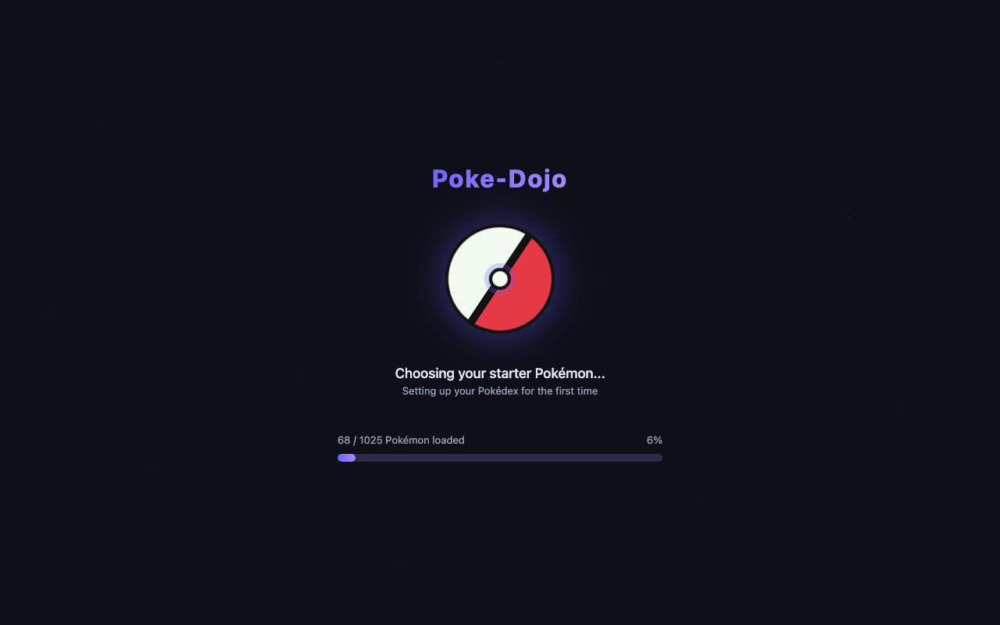
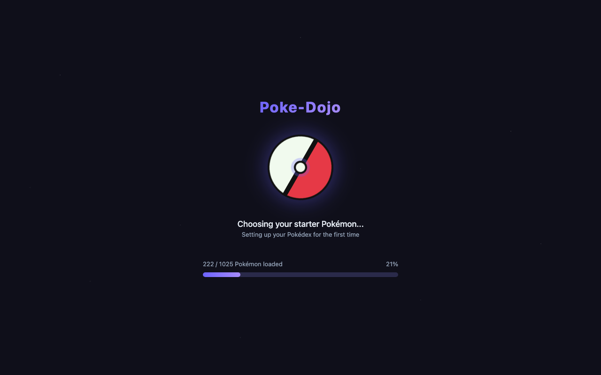
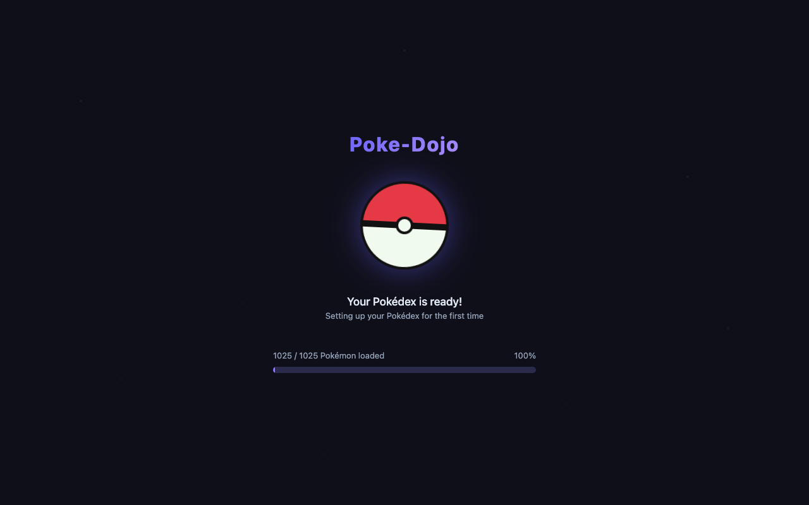
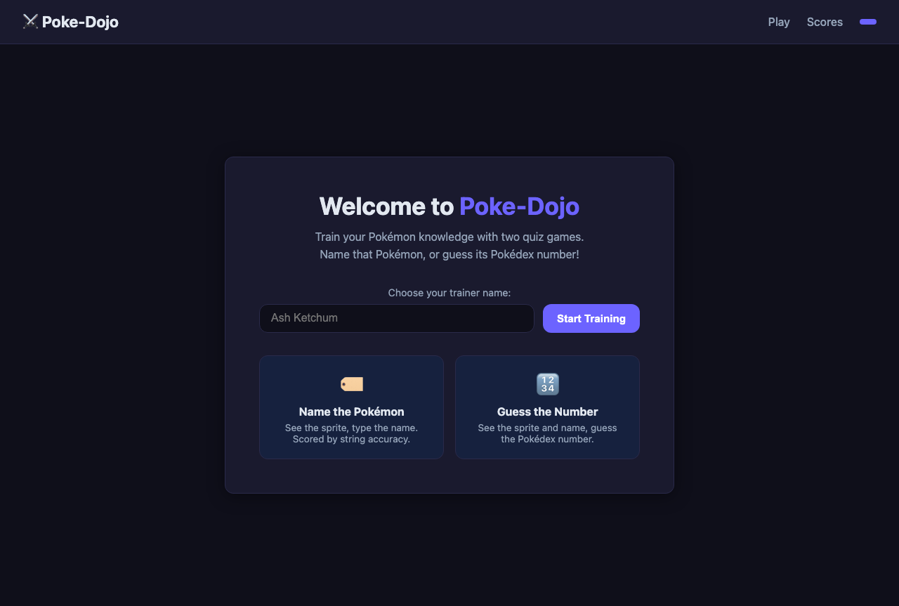
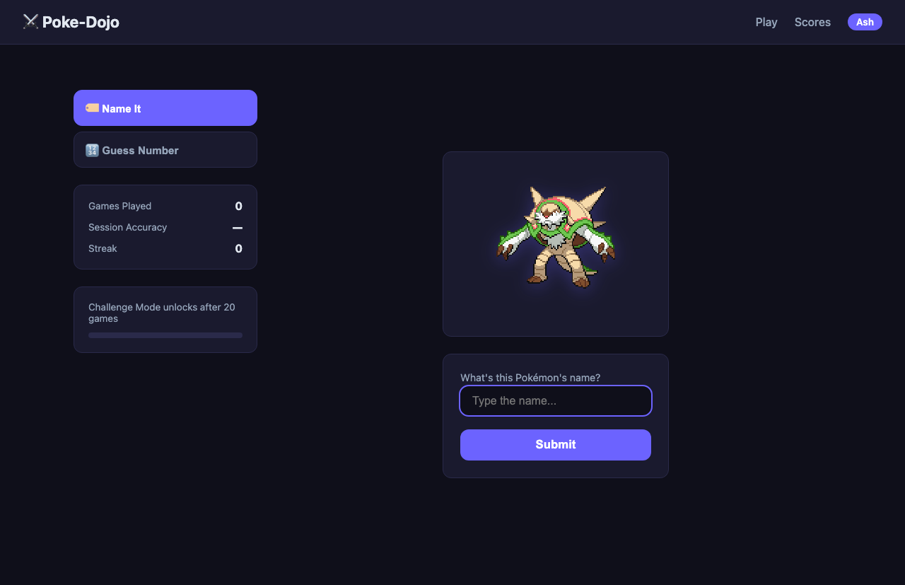
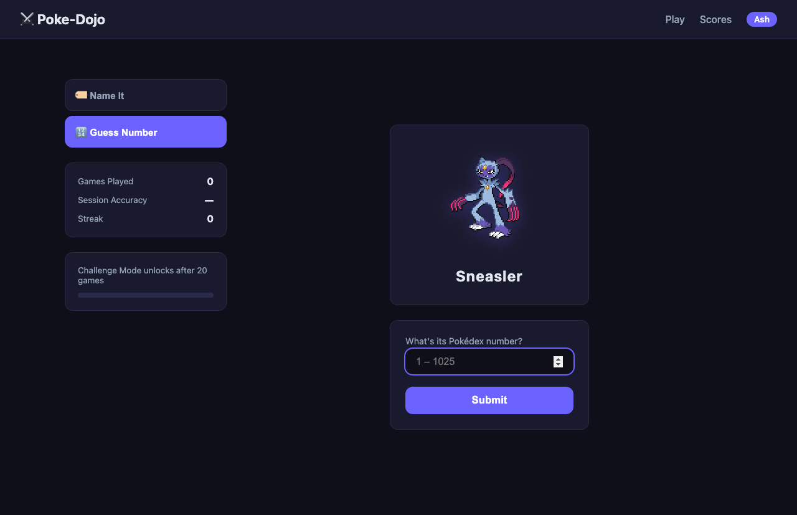
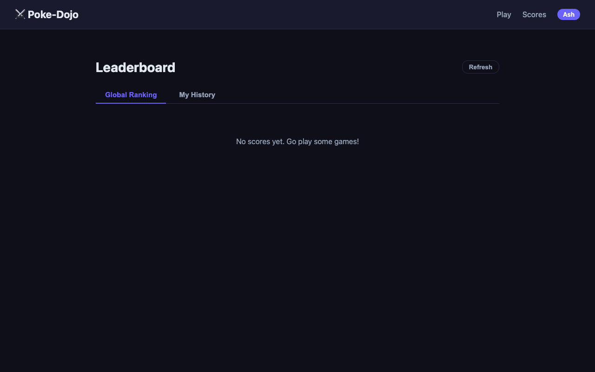

# Poke-Dojo ⚔️

A local Pokémon training web app with two quiz games, a leaderboard, and an XGBoost-powered **Challenge Mode** that learns which Pokémon trip you up and serves them more often.

---

## Screenshots

### First Run — Loading Screen
On first launch the app automatically fetches all 1025 Pokémon from PokéAPI in the background while you watch a spinning Pokéball and rotating Pokémon-themed messages.

| Start (6%) | Mid-fetch (21%) | Ready (100%) |
|---|---|---|
|  |  |  |

### Home Page
Enter your trainer name to begin. No account required — your name is saved in the browser.



### Game 1 — Name the Pokémon
A Pokémon sprite is shown. Type the name and press **Enter**. Accuracy is scored using fuzzy string matching (rapidfuzz), so near-misses are rewarded.



### Game 2 — Guess the Pokédex Number
The sprite and name are shown. Enter the Pokédex number (1–1025) and press **Enter**. The closer you are, the higher your score.



### Leaderboard
Track your accuracy across both game types, your personal history, and compare with other trainers.



---

## Installation

### Requirements
- Python 3.12+
- [uv](https://docs.astral.sh/uv/) (fast Python package manager)
- macOS: `brew install libomp` (required by XGBoost)

### Setup

```bash
# 1. Clone the repo
git clone <repo-url>
cd poke-dojo

# 2. Install dependencies (creates .venv automatically)
uv sync

# 3. macOS only — XGBoost needs OpenMP
brew install libomp
```

---

## Running the Game

```bash
uv run uvicorn app.main:app --reload
```

Open **http://localhost:8000** in your browser.

**First run:** The app detects an empty database and automatically fetches all 1025 Pokémon from PokéAPI in the background (~30–40 minutes due to polite rate limiting). You'll see the loading screen with a progress bar. Subsequent starts are instant.

**Optional — pre-fetch before starting the server:**
```bash
uv run python data/fetch_data.py
```

---

## How to Play

### Trainer Name
Enter any name on the home screen. It's saved in your browser — no account needed.

### Game 1 — Name the Pokémon
1. A Pokémon sprite appears (name hidden).
2. Type the Pokémon's name in the text box.
3. Press **Enter** to submit.
4. See your accuracy score (0–100%).
5. Press **Enter** again (or click **Next Pokémon**) to continue.

### Game 2 — Guess the Pokédex Number
1. A Pokémon sprite and its name appear.
2. Enter what you think its Pokédex number is (1–1025).
3. Press **Enter** to submit.
4. See how far off you were and your accuracy score.
5. Press **Enter** again to continue.

### Scoring
- **Game 1:** `rapidfuzz.fuzz.ratio(your_guess, correct_name)` → 0–100%
- **Game 2:** `max(0, 100 × (1 − |guess − actual| / 1025))` → 0–100%
- A score ≥ 80% counts toward your streak counter.

### Challenge Mode
After **20 games** a "Challenge Mode" toggle appears in the sidebar. When enabled, an **XGBoost model** trained on your personal game history picks the Pokémon it predicts you'll find hardest. The model retrains every 10 games.

### Music
The game plays synthesised Pokémon Red/Blue soundtrack (Pallet Town, Route 1, Pokémon Center, Wild Battle, Gym Leader Battle) via the Web Audio API. Use the 🔊 button in the sidebar to mute, and the ◀ ▶ buttons to switch tracks. Music starts on your first click.

---

## Package Management

Always use `uv` — never `pip` directly.

```bash
uv add <package>          # add a runtime dependency
uv add --dev <package>    # add a dev dependency
uv sync                   # install from lockfile
```

---

## Project Structure

```
poke-dojo/
├── app/
│   ├── main.py               # FastAPI app, startup event, page routes
│   ├── database.py           # SQLAlchemy engine + session
│   ├── models.py             # Pokemon, User, GameResult ORM models
│   ├── routers/
│   │   ├── game.py           # /game/start, /game/submit
│   │   ├── scores.py         # /scores/leaderboard, /scores/user/{name}
│   │   └── challenge.py      # /challenge/status, /challenge/train
│   ├── services/
│   │   ├── data_loader.py    # Background PokeAPI fetch with progress tracking
│   │   ├── string_match.py   # rapidfuzz accuracy for Game 1
│   │   ├── pokemon_data.py   # Random Pokémon selection, number accuracy
│   │   └── xgboost_model.py  # Per-user XGBoost difficulty predictor
│   └── templates/            # Jinja2 HTML templates
├── data/
│   ├── fetch_data.py         # Manual pre-fetch script (optional)
│   └── pokemon.db            # SQLite database (git-ignored)
└── static/
    ├── css/style.css
    └── js/game1.js, game2.js
```

---

## Tech Stack

| Component | Technology |
|---|---|
| Backend | FastAPI + Uvicorn |
| Database | SQLite via SQLAlchemy |
| String matching | rapidfuzz |
| ML (Challenge Mode) | XGBoost |
| Music synthesis | Tone.js (Web Audio API) |
| Package manager | uv |
| Data source | PokéAPI (pokeapi.co) |
